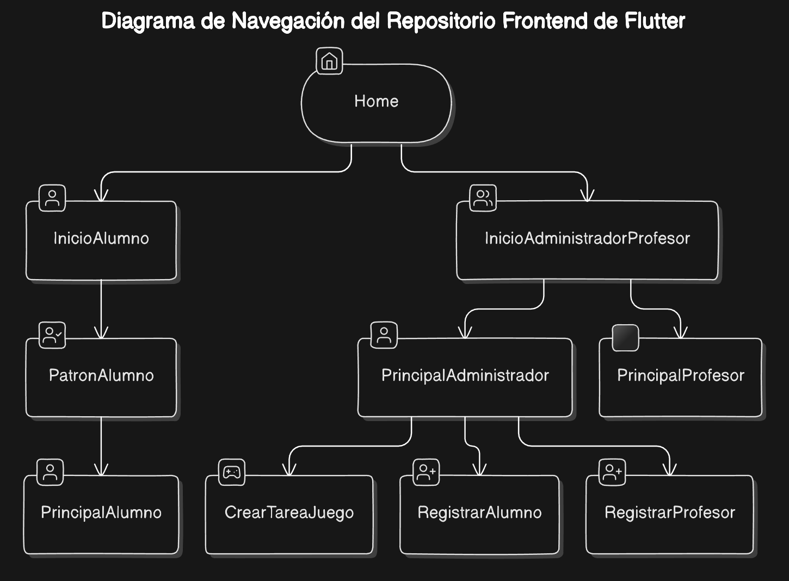

# TARERIO - Frontend de la Aplicación de Gestión de Tareas y Agenda para Estudiantes PTVAL

## Descripción del Proyecto

El frontend de TARERIO es una aplicación móvil desarrollada en Dart/Flutter que permite a los estudiantes, profesores y administradores del Centro San Rafael acceder a sus aulas virtuales, tareas y funcionalidades de comunicación. Este repositorio contiene la primera iteración de la aplicación, que incluye las pantallas principales, widgets personalizados, y la conexión con el backend mediante APIs específicas para el registro, inicio de sesión y gestión de tareas.

## Estructura del Proyecto

Este es el árbol de directorios actual de la primera iteración del proyecto:

```bash
.
├── API
│   ├── inicioSesionAPI.dart
│   ├── registrarAlumnoAPI.dart
│   ├── registrarProfesorAPI.dart
│   └── TareaJuegoAPI.dart
├── main.dart
├── Models
│   └── menuAccesible.dart
├── Pages
│   ├── crearTareaJuego.dart
│   ├── home.dart
│   ├── inicioAdministradorProfesor.dart
│   ├── inicioAlumno.dart
│   ├── patronAlumno.dart
│   ├── principalAdministrador.dart
│   ├── principalAlumno.dart
│   ├── registrarAlumno.dart
│   └── registrarProfesor.dart
└── Widgets
    ├── AppBarDefault.dart
    ├── Avatar.dart
    ├── DefaultButton.dart
    ├── DefaultSwitch.dart
    ├── ErrorModal.dart
    ├── Header.dart
    ├── InformationModal.dart
    ├── Navbar.dart
    ├── SuccessModal.dart
    └── TextFieldDefault.dart
```

## Funcionalidades Clave

1. **Inicio de Sesión y Registro**:
    - Registro de alumnos y profesores mediante llamadas a la API.
    - Inicio de sesión seguro para administradores, profesores y alumnos.

2. **Gestión de Tareas**:
    - Creación de tareas de tipo "Juego" por parte de los profesores.
    - Visualización y actualización de estado de las tareas asignadas.

3. **Navegación Dinámica**:
    - Interfaz adaptada para diferentes roles de usuario (alumno, profesor, administrador).
    - Navegación entre pantallas mediante un flujo estructurado y modales informativos.

## UI/UX

Para el desarrollo de la interfaz se han diseñado mockups y wireframes que se incluirán en esta sección para mantener una referencia visual de cada iteración:

### Pantalla Principal


## Diagrama de navegación de la aplicación





## Configuración e instalación

Para instalar y ejecutar la aplicación en un entorno local, se deben seguir los siguientes pasos:

1. Clonar el repositorio en la máquina local.

```bash
git clone https://github.com/tuusuario/tarerio-frontend.git
cd tarerio-frontend
```

2. Instalar las dependencias del proyecto.

```bash
flutter pub get
```

3. Ejecutar la aplicación en un emulador o dispositivo físico.

```bash
flutter run
```

<br>

¡Gracias por tu interés en TARERIO!


